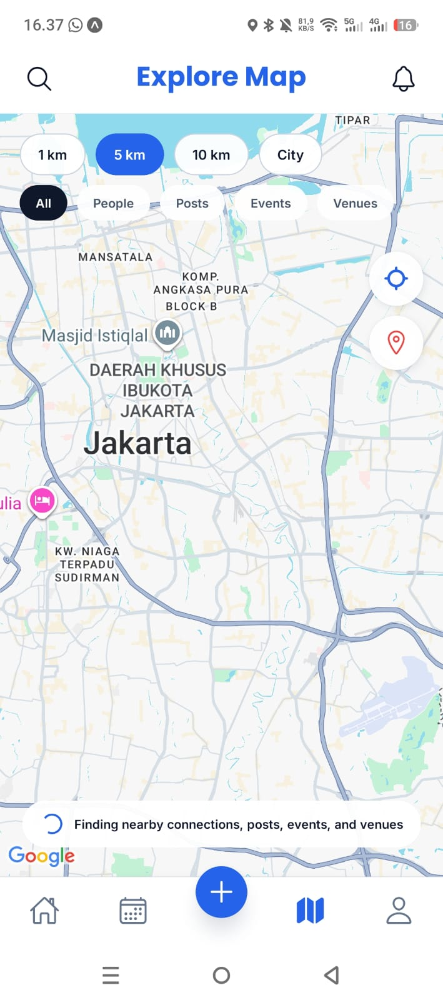
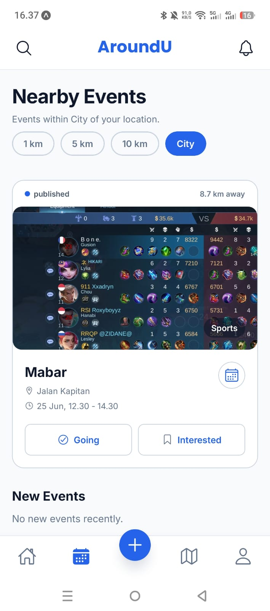
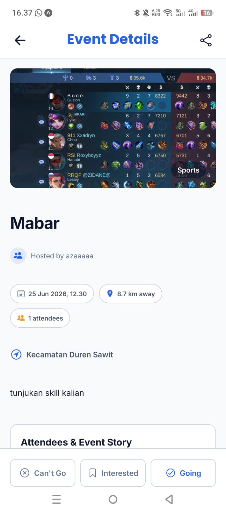
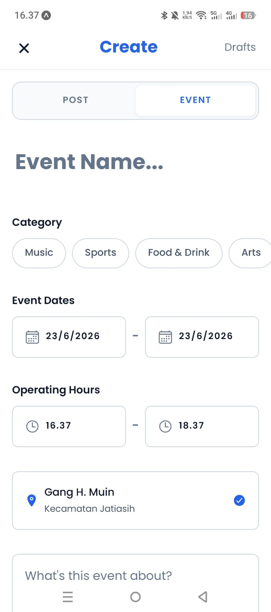
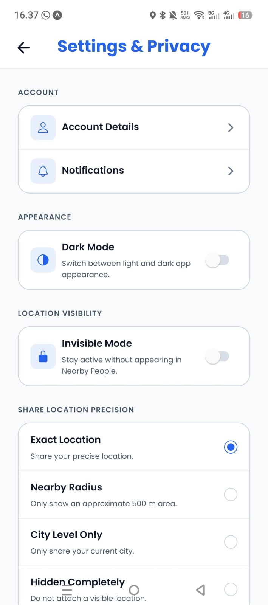

# GeoConnect Mobile

Aplikasi mobile komunitas berbasis lokasi (GeoConnect) yang dibangun dengan Expo. Cabang `main` dikelola agar tetap bersih sebagai dasar pengembangan fitur.

## Teknologi

- **Core**: React Native 0.81, React 19.1, Expo SDK 54
- **Navigasi**: React Navigation 7 (Bottom Tabs, Drawer, Native Stack)
- **State Management**: Zustand 5
- **Backend & Database**: Firebase (Auth & Firestore)
- **Lokasi & Peta**: `react-native-maps`, `expo-location`, `geofire-common` (untuk pencarian *geo-query*)
- **Autentikasi**: `@react-native-google-signin/google-signin` (Google OAuth)
- **Media & Penyimpanan**: Cloudinary, `expo-image`, `expo-image-picker`
- **Animasi & Interaksi**: Reanimated 4, React Native Gesture Handler (menggunakan *New Architecture*)
- **Notifikasi**: `expo-notifications`, `expo-device`
- **Lain-lain**: `@expo-google-fonts`, `expo-crypto`, `expo-linear-gradient`

## Panduan Instalasi & Menjalankan Aplikasi

1. **Instal Dependensi**
   ```bash
   npm install
   ```

2. **Konfigurasi `.env`**
   Salin `.env.example` menjadi `.env` lalu isikan *API key* kamu:
   ```env
   # Firebase
   EXPO_PUBLIC_FIREBASE_API_KEY=kunci_api
   EXPO_PUBLIC_FIREBASE_AUTH_DOMAIN=domain
   EXPO_PUBLIC_FIREBASE_PROJECT_ID=id_proyek
   EXPO_PUBLIC_FIREBASE_STORAGE_BUCKET=bucket
   EXPO_PUBLIC_FIREBASE_MESSAGING_SENDER_ID=sender
   EXPO_PUBLIC_FIREBASE_APP_ID=app_id
   EXPO_PUBLIC_FIREBASE_MEASUREMENT_ID=measurement
   
   # Google Auth & Maps
   EXPO_PUBLIC_GOOGLE_WEB_CLIENT_ID=client_web
   EXPO_PUBLIC_GOOGLE_ANDROID_CLIENT_ID=client_android
   EXPO_PUBLIC_GOOGLE_MAPS_API_KEY=kunci_maps # Fallback ke FIREBASE_API_KEY jika kosong
   
   # Cloudinary
   EXPO_PUBLIC_CLOUDINARY_CLOUD_NAME=cloud_name
   EXPO_PUBLIC_CLOUDINARY_UPLOAD_PRESET=preset
   EXPO_PUBLIC_CLOUDINARY_UPLOAD_FOLDER=folder
   ```

3. **Jalankan Aplikasi**
   - **Lokal (Expo Go)**: `npm start` atau `npx expo start`
   - **Build APK (EAS)**: Sebelum rilis, unggah environment dengan `eas secret:push --env-file .env`, lalu jalankan `eas build --platform android --profile preview`

> *Catatan: Google OAuth dan Google Maps memerlukan build EAS/development agar berfungsi penuh secara native.*

## Struktur Folder & Kepemilikan

Semua komponen tertata di dalam direktori `src/` (`navigation`, `screens`, `components`, `services`, `stores`, dll).
- **Latanza**: `auth`, integrasi Firebase, skema DB, geo-query.
- **Dika**: `home`, `post`, feed, interaksi sosial (like/comment/follow).
- **Zidan**: Antarmuka UI, `notification`, check-in.
- **Zanet**: `map`, fitur peta, marker, venue.

**Dokumentasi Lanjutan:**
- Setup Backend: `docs/FIREBASE_CLOUDINARY_SETUP.md`
- Skema Database: `docs/FIRESTORE_SCHEMA.md`
- Aturan Privasi & Lokasi: `docs/LOCATION_PRIVACY.md` *(Lokasi hanya diminta saat dibutuhkan)*
- Standar Kode: `docs/CODE_STRUCTURE_GUIDE.md`

## Screenshot Fitur Utama

| Peta Utama (Maps) | Daftar Acara (Event) | Detail Acara |
| :---: | :---: | :---: |
|  |  |  |

| Membuat Acara | Pengaturan & Akun |
| :---: | :---: |
|  |  |
