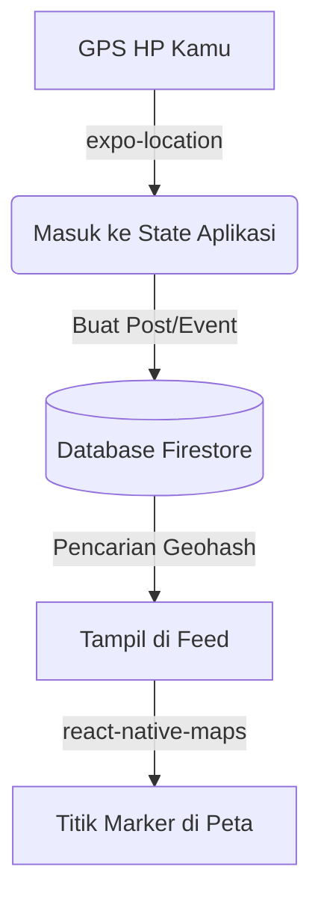

# 🌍 Teknologi Lokasi (Location Tech Stack)

Dokumen ini adalah ringkasan dapur pacu dari fitur peta dan geospasial di **AroundU**. Kalau kamu penasaran bagaimana cara kami mencari postingan di sekitarmu dalam hitungan detik, ini jawabannya! 🚀

---

## 🗺️ Gambaran Sistem

Secara garis besar, beginilah perjalanan koordinat lokasimu dari HP sampai muncul di peta:

---

## 📡 Bagaimana Kami Mendapatkan Lokasimu?
Kami menggunakan modul `expo-location` bawaan dari Expo:
1. **Saat Aplikasi Dibuka:** Kami meminta koordinat dengan akurasi seimbang (*Balanced Accuracy*) untuk menggeser peta tepat ke lokasimu.
2. **Persetujuan Izin Bertahap:** Kami tidak akan memaksa meminta izin *Background Location* di awal. Kami hanya akan meminta izin *Foreground* (saat aplikasi dipakai) terlebih dahulu agar pengguna tidak kaget.

---

## ⚡ Rahasia Pencarian Cepat: Geohash
Karena database *Firebase Firestore* tidak bisa mencari berdasarkan *Latitude* dan *Longitude* sekaligus, kami menggunakan algoritma ajaib bernama **Geohash**.

**Gimana Cara Kerjanya?**
1. Kami mengubah koordinat GPS 2D (misal: `-6.200, 106.816`) menjadi satu baris teks (*string*) seperti `qqgu2b3`.
2. Titik-titik lokasi yang berdekatan di dunia nyata akan memiliki teks awalan yang sama!
3. Saat kamu membuka aplikasi, kami membuat "Kotak Pencarian" di sekitarmu dan menyuruh Firestore mencari semua teks *geohash* yang mirip. Jauh lebih ringan dan cepat!

---

## 📍 Menghitung Jarak Akurat (Formula Haversine)
Karena Geohash bentuk pencariannya kotak (bukan lingkaran sempurna), kadang ada hasil yang *sedikit* meleset di ujung-ujung kotak. 

Untuk memastikan tulisan "2.5 km dari kamu" di aplikasi itu akurat 100%, kami menghitung ulang jarak aslinya di HP kamu (*Client-side*) menggunakan **Formula Haversine** sebelum menampilkannya di layar. Hasil yang terlalu jauh akan langsung dibuang!

---

## 🏨 Integrasi Foursquare (Fitur Check-in)
Kalau kamu mau membagikan lokasimu di kafe atau taman tertentu, kami menggunakan **Foursquare Places API**. 
- Kami mengirimkan perkiraan lokasimu ke *server proxy* kami (di Cloudflare).
- Foursquare membalas dengan daftar tempat terdekat yang valid.
- Kamu tinggal pilih tempatnya, lalu ID tempat tersebut disimpan di postinganmu.

---

## 🚀 Performa & Optimasi Peta
Menampilkan ratusan titik di peta bisa bikin HP lag. Makanya kami menggunakan trik:
- **Debounce:** Saat kamu menggeser peta dengan cepat, kami tidak langsung mengirim kueri ke server di setiap milidetik. Kami menunggu kamu berhenti menggeser peta selama setengah detik, baru memuat data baru.
- **Batas Tampilan:** Kami membatasi maksimal 50 dokumen per pencarian area untuk menghemat kuota pembacaan (*read quota*) Firebase sekaligus menjaga HP kamu tetap ngebut!

💡 *Arsitektur ini dirancang supaya aplikasi tetap responsif meskipun dipakai oleh jutaan orang secara bersamaan!*
