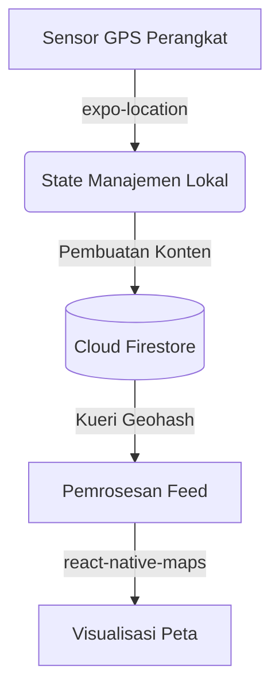

# Arsitektur dan Teknologi Lokasi

Dokumen ini menjelaskan arsitektur teknis dan algoritma yang menggerakkan fitur geospasial pada aplikasi AroundU, mulai dari akuisisi koordinat hingga visualisasi pada peta.

## 1. Alur Sistem Geospasial
Sistem mengelola siklus hidup data lokasi melalui komponen berikut:

## 2. Akuisisi Koordinat Lokasi
Aplikasi memanfaatkan modul `expo-location` untuk mengambil data lokasi pengguna:
- **Latar Depan (Foreground):** Aplikasi meminta koordinat dengan tingkat akurasi seimbang (Balanced Accuracy) untuk memperbarui Peta Eksplorasi saat aplikasi sedang digunakan.
- **Sistem Perizinan Bertahap:** Izin lokasi diminta secara transparan. Izin latar belakang (Background Location) tidak diwajibkan secara bawaan, dan aplikasi menyediakan mekanisme alternatif (pencarian manual) apabila izin ditolak.

## 3. Optimasi Pencarian Geospasial dengan Geohash
Firestore tidak memiliki dukungan bawaan untuk kueri koordinat multi-dimensi secara langsung. Untuk mengatasi hal ini, AroundU mengimplementasikan algoritma **Geohash**:
- Geohash mengonversi koordinat lintang (latitude) dan bujur (longitude) menjadi sebuah string alfanumerik tunggal.
- Area yang berdekatan secara geografis akan memiliki awalan string geohash yang sama. 
- Aplikasi melakukan pencarian "Kotak Pembatas" (Bounding Box Query) untuk memfilter rentang string geohash yang identik di sekitar area pengguna, mengurangi beban komputasi server secara signifikan.

## 4. Penghitungan Jarak Akurat
Kueri Geohash pada dasarnya menghasilkan area pencarian berbentuk persegi, yang dapat mengembalikan hasil di luar radius lingkaran yang diinginkan (false positives).
Oleh karena itu, aplikasi menerapkan pemfilteran sisi klien menggunakan **Formula Haversine**. Formula ini menghitung jarak garis lurus bola bumi antara pengguna dan titik lokasi dokumen. Dokumen yang berada di luar batas radius akan dibuang sebelum dirender ke antarmuka pengguna.

## 5. Integrasi Foursquare API
Untuk fitur penandaan tempat (check-in), aplikasi menggunakan Foursquare Places API:
1. Koordinat pengguna dikirimkan melalui server proksi (Cloudflare Worker).
2. Sistem mengambil daftar tempat komersial atau fasilitas umum terdekat yang divalidasi oleh Foursquare.
3. ID tempat (Venue ID) yang dipilih pengguna akan disimpan ke dalam dokumen Firestore, memastikan integrasi tempat berjalan efisien tanpa menyimpan metadata tempat yang redundan.

## 6. Manajemen Performa Rendering
Untuk memastikan antarmuka peta tetap mulus (60 FPS) meskipun menampilkan ratusan titik penanda (marker):
- **Debouncing Kueri:** Permintaan data ke basis data ditunda hingga pengguna selesai menggeser peta selama periode waktu tertentu, mencegah permintaan data berlebih.
- **Pembatasan Dokumen:** Kueri geospasial dibatasi secara ketat (maksimal 50 dokumen per area pembatas) guna meminimalkan penggunaan memori klien dan mengoptimalkan kuota baca Firestore.
