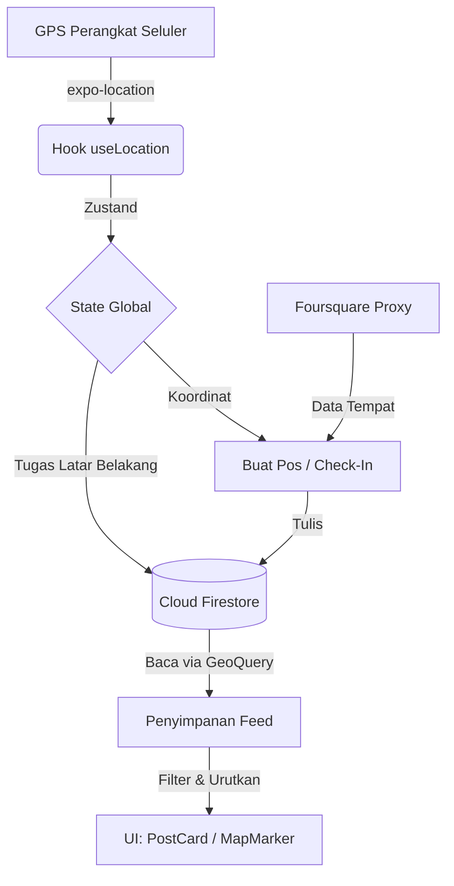

# D5-3: Dokumen Teknologi Lokasi (Location Technology Document)
**Proyek:** AroundU - Aplikasi Penemuan Sosial Berbasis Lokasi (Location-Based Social Discovery)
**Tipe Dokumen:** Hasil Serahan Akademis (Arsitektur Sistem & Rekayasa Perangkat Lunak)

---

## 1. Gambaran Umum
Dokumen ini merinci arsitektur rekayasa yang mengatur kemampuan geospasial "AroundU". Dokumen ini mencakup siklus hidup penuh dari data lokasi: mulai dari akuisisi perangkat keras melalui Expo Location, pemetaan penyimpanan di Cloud Firestore, hingga penyajian (*rendering*) di sisi klien melalui React Native Maps dan algoritma `geofire-common`.

## 2. Arsitektur Sistem

Diagram berikut mengilustrasikan aliran data geospasial dalam aplikasi:



## 3. Alur Akuisisi Lokasi
Koordinat diperoleh menggunakan pembungkus (*wrapper*) `expo-location` yang mengakses API lokasi bawaan (native) dari iOS/Android.
*   **Latar Depan (Foreground):** Saat aplikasi dibuka, `getCurrentPositionAsync(Accuracy.Balanced)` dipanggil untuk menetapkan batas wilayah awal (*bounding box*).
*   **Latar Belakang (Background):** Menggunakan `expo-task-manager`, sebuah tugas JavaScript tanpa antarmuka berjalan untuk mendengarkan perubahan lokasi yang signifikan, menyinkronkan kehadiran pengguna ke Firestore tanpa mengharuskan aplikasi aktif digunakan.

## 4. Penanganan Izin (Permission Handling)
Izin diminta secara hierarkis untuk mematuhi panduan App Store / Play Store:
1.  **Persetujuan Latar Depan:** Pengguna diminta memberikan izin `locationWhenInUsePermission` yang merinci mengapa sensor lokasi diperlukan.
2.  **Persetujuan Latar Belakang:** Hanya setelah izin latar depan disetujui, `locationAlwaysAndWhenInUsePermission` akan diminta, dengan penjelasan khusus mengenai fitur pelacakan di latar belakang.
3.  **Fallback (Alternatif):** Jika ditolak, aplikasi akan menurun secara elegan ke mode pencarian kota secara manual.

## 5. Arsitektur Rendering Peta
Pustaka `react-native-maps` menyediakan lapisan visualisasi utama.
*   **Penyedia (Provider):** Secara *default* menggunakan Apple Maps di iOS dan Google Maps di Android.
*   **Rendering:** Komponen kustom `Marker` dipetakan dari data muatan GeoFirestore yang diambil. Untuk mencegah kebocoran memori (memory leak) selama penggeseran peta yang cepat, fungsi `onRegionChangeComplete` memberikan jeda waktu (*debounce*) pada kueri kotak pembatas, sehingga tidak terpicu di setiap titik geser.

## 6. Model Data Lokasi Firestore
Standardisasi penyimpanan koordinat sangat penting untuk kompatibilitas `geofire-common`.

**Contoh Dokumen Pos (`posts/{postId}`):**
```json
{
  "caption": "Menikmati konser!",
  "creatorId": "uid_12345",
  "location": {
    "latitude": -6.200000,
    "longitude": 106.816666,
    "geohash": "qqgu2b3",
    "visibility": "exact" 
  },
  "createdAt": "Timestamp"
}
```

## 7. Strategi Kueri Geospasial
Firestore tidak secara bawaan mendukung kueri spasial multi-dimensi (misalnya, `WHERE lat < X AND long > Y`). 
Kami mengimplementasikan **Algoritma Geohash** melalui `geofire-common`.
*   Sebuah geohash mengubah koordinat 2D menjadi string 1D. Kedekatan dalam ruang geospasial diterjemahkan menjadi kemiripan awalan string (misalnya, `qqgu2` dan `qqgu3` berdekatan).
*   Saat membuat dokumen, fungsi `geofire.geohashForLocation([lat, lng])` menghitung nilai *hash* tersebut.

## 8. Implementasi Pencarian Terdekat
Untuk menemukan pos dalam radius tertentu (mis., 5km), aplikasi melakukan kueri kotak pembatas (**Bounding Box Query**):
1.  Hitung larik kotak pembatas: `geofire.getGeoQueryBounds(center, radius)`.
2.  Jalankan beberapa kueri Firestore secara bersamaan yang mencakup rentang *hash* ini.
```javascript
// Contoh Alur Kueri
const bounds = getGeoQueryBounds(center.latitude, center.longitude, radiusMeters);
const promises = bounds.map(b => 
  getDocs(query(collection, orderBy('location.geohash'), startAt(b[0]), endAt(b[1])))
);
const snapshots = await Promise.all(promises);
```

## 9. Metode Perhitungan Jarak
Kueri Geohash mengembalikan kotak pembatas berbentuk persegi, yang berarti beberapa hasil di bagian tepi mungkin lebih jauh dari radius lingkaran yang sebenarnya.
**Formula Haversine:** Filter di sisi klien (`geofire.distanceBetween`) menghitung jarak lingkaran besar (great-circle distance) yang tepat antara koordinat pengguna dan koordinat dokumen, membuang hasil positif palsu (*false positives*) dan memberikan nilai `distanceMeters` yang akurat untuk antarmuka UI.

## 10. Mekanisme Check-In
*Check-in* mengandalkan arsitektur hibrida:
1.  Koordinat pengguna dikirim ke Cloudflare Worker (sebagai Proxy).
2.  Proxy tersebut memanggil **Foursquare Places API** untuk mengembalikan tempat/venue terverifikasi yang berada di sekitar.
3.  Pengguna memilih tempat; ID dari Foursquare (`fsq_id`) dan nama tempat tersebut ditulis ke dalam dokumen pos di Firestore.

## 11. Manajemen Lokasi Acara (Events)
Acara (Event) menggunakan objek peta lokasi yang sama persis dengan Pos. Namun, acara disajikan (di-*render*) pada lapisan peta yang terpisah. Reservasi kehadiran (RSVP) tidak mengubah lokasi acara, melainkan hanya menambahkan pengguna ke subkoleksi (`events/{id}/attendees`), memastikan nilai geohash dokumen induknya tetap statis.

## 12. Pertimbangan Performa
*   **Overhead Indeks:** Mengurutkan berdasarkan `location.geohash` memerlukan indeks komposit di Firestore untuk setiap parameter filter penyertanya (mis., `geohash` + `createdAt`).
*   **Batas Pembacaan (Read Limits):** Kueri kotak pembatas dapat mengembalikan ribuan dokumen di kota yang padat. Kueri dibatasi secara ketat menggunakan perintah `limit(50)` per rentang *hash*.

## 13. Pertimbangan Keamanan dan Privasi
*   **Lokasi Diburamkan (Blurred Locations):** Jika pengguna memilih "Hanya Kota", UI akan membulatkan koordinat atau menghapus label `distanceMeters`, meskipun server (backend) tetap memerlukan geohash yang disederhanakan untuk kueri regional.
*   **Spoofing (Pemalsuan Lokasi):** GPS dari sisi klien secara inheren dipercaya. Iterasi masa depan mungkin memerlukan pemeriksaan kecepatan di sisi server untuk mencegah pemalsuan (*spoofing*) payload API.

## 14. Batasan dan Kompromi (Tradeoffs)
*   **Kotak Pembatas Firestore:** Melakukan kueri yang melintasi meridian ke-180 (Garis Tanggal Internasional) memerlukan penanganan kasus khusus yang kompleks dalam *geohashing*.
*   **Tidak Ada Websocket Real-time untuk Peta:** Untuk menghemat kuota pembacaan Firestore, peta menggunakan metode `getDocs` (pengambilan satu kali) alih-alih `onSnapshot` (pendengar *real-time* terus menerus).

## 15. Peningkatan di Masa Future
*   Mengimplementasikan **Marker Clustering** (misalnya, algoritma Supercluster) untuk menangani >1000 pin peta secara bersamaan tanpa menurunkan *frame rate* atau membuat ponsel lambat.
*   Memigrasi seluruh logika proxy Foursquare ke Firebase Cloud Functions untuk arsitektur backend yang lebih terpusat.

## 16. Kesimpulan
Dengan memanfaatkan algoritma Geohash yang dipadukan dengan Cloud Firestore, AroundU mencapai sistem kueri geospasial tanpa server (*serverless*) yang dapat diskalakan. Arsitektur ini memprioritaskan performa di sisi klien dan desain komponen yang modular, memenuhi standar ketat aplikasi berbasis lokasi modern.
